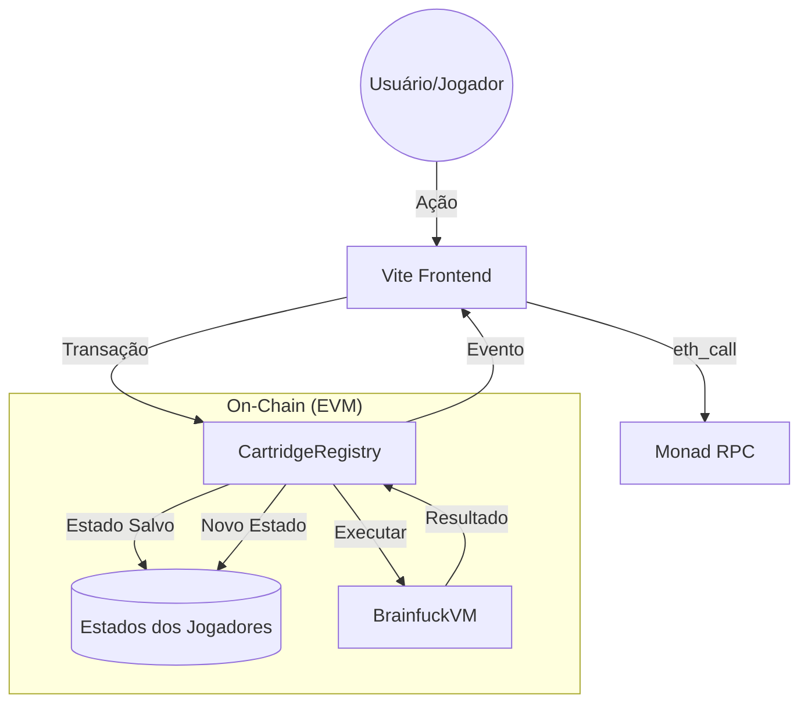

# 🧠 Console Virtual Brainfuck — VM On-Chain

Este projeto implementa uma **Console Virtual completa e 100% on-chain** na rede **Monad**. Ele permite a execução de bytecode Brainfuck diretamente na EVM, viabilizando jogos descentralizados e simulações complexas de autômatos celulares com alta performance.

---

## 🏗 Arquitetura do Sistema

A solução é composta por dois contratos inteligentes principais que gerenciam desde a interpretação do código até a persistência do progresso do jogador.

### 1. BrainfuckVM.sol (O Motor)
O **BrainfuckVM** é o interpretador core. Ele não conhece "jogos", apenas instruções.
- **Set de Instruções**: Suporta os 8 comandos padrão (`> < + - . , [ ]`).
- **Memória (Tape)**: Uma fita de 30.000 células (uint8) que funciona como a RAM da console.
- **Segurança**: Utiliza um limite de `maxSteps` para evitar loops infinitos.
- **Custo**: Otimizado para rodar em redes de alto rendimento como Monad, onde o custo de computação é drasticamente reduzido.

### 2. CartridgeRegistry.sol (O Console)
O **CartridgeRegistry** funciona como o sistema operacional e a "loja" de cartuchos.
- **Cartuchos**: Desenvolvedores registram programas Brainfuck como "Cartuchos".
- **Save States (Saves)**: O diferencial deste projeto. Ele mantém um estado persistente para **cada jogador por cartucho**. Seu progresso é salvo automaticamente na blockchain ao final de cada jogada.
- **Modos de Jogo**:
    - **Stateless (Sem Estado)**: Para funções puras ou jogos que não precisam salvar (ex: Gerador de Dados).
    - **Stateful (Com Estado)**: Para jogos complexos onde o estado anterior é carregado, processado e atualizado (ex: Tamagotchi).

---

## 🔄 Fluxo de Interação



---

## 🎮 Exemplos de Implementação

### 🐾 Tamagotchi (Pet On-Chain)
Uma simulação de estado onde:
1. O **estado inicial** (fome, felicidade, energia) é carregado do contrato.
2. O usuário envia uma **ação** (Alimentar, Brincar, Dormir).
3. A **VM Brainfuck** processa essa ação contra o estado atual.
4. O **Novo Estado** resultante é gravado de volta no seu "Save" no Registry.

### 🎲 Dice Roller
Uma simulação matemática pura. Ele recebe um "seed" do frontend e executa a lógica de RNG (Geração de Números Aleatórios) totalmente on-chain via `staticCall` (rápido e gratuito para visualização).

---

## 🛠 Como Adicionar um Novo Jogo (Cartucho)

Adicionar um novo jogo é como "inserir um cartucho" na console. O processo segue estes passos:

### 1. Escrever o Código Brainfuck
Você deve criar a lógica do seu jogo em Brainfuck. O programa receberá como entrada (`input`) os dados enviados pelo jogador (e o estado salvo, se houver).

### 2. Registrar no CartridgeRegistry
Use a função `loadCartridge` no contrato `CartridgeRegistry`:

```solidity
function loadCartridge(
    bytes calldata program,      // Seu código Brainfuck em bytes
    string calldata name,         // Nome do jogo (ex: "Snake")
    bytes calldata defaultState   // Estado inicial para novos jogadores (opcional)
) external returns (uint256 cartridgeId);
```

### 3. Definir a Lógica de Estado
- Se o jogo for **Stateless**, o jogador usa `play()`.
- Se o jogo tiver **Persistência**, o jogador primeiro utiliza `initState()` para criar seu save-game e depois `playWithState()`.

---

## 🚀 Por que Monad?
Este projeto foi desenhado para explorar a **Arquitetura de Alto Rendimento da Monad**. Interpretar uma VM dentro da EVM é algo caro no Ethereum tradicional. Na Monad:
- Podemos rodar **1.000 células** de simulação em milissegundos.
- As consultas via `eth_call` são extremamente rápidas, permitindo interfaces fluidas mesmo com lógica on-chain.
- O custo de salvar estados complexos de jogadores se torna viável para jogos em escala.

---

*“100% On-Chain. 100% Descentralizado. 100% Brainfuck.”*
